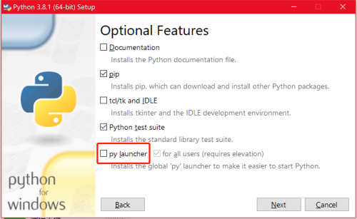

Title: Windows 中管理多版本 Python
Date: 2019-12-29 16:18:22
Category: Python
Tags: Python

## 多版本 Python

各个版本的 Python 并不是很兼容，有时，我们需要在一台电脑上安装多个版本的 Python 来保证一些代码的兼容。

安装的 Python 提供的 py 命令，可以在 Windows 上方便的安装、管理多版本的 Python。

## 安装 py 命令

在安装 Python 的时候，勾选 py launch 选择项。

安装成功后，会自动添加 py 命令。

## py 命令的使用

我们在命令行输入 py 命令，会打开默认的 Python 解释器。

如果我们的电脑上安装了多个版本的 Python。可以使用：

    py -0

来查看当前电脑所有安装的 Python 版本。输出如下：

    Installed Pythons found by py Launcher for Windows
    -3.8-64 *
    -3.7-64
    -3.6-64

可以看到，电脑上安装了 3 个版本的 Python。* 表示当前默认版本的 Python，即运行 py 不指定版本时，使用的版本。

## 指定 Python 版本运行

我们可以使用:

    py -3.6

来指定需要使用的 Python 版本是 Python3.6。

如果我们需要创建一个 Python3.6 版本的虚拟环境，可以使用：

    py -3.6 -m venv venv_name

venv_name 表示的是要创建的虚拟环境的文件夹名字。我们可以任意指定。

这样，我们在激活虚拟环境后，就可以使用个 3.6 版本的 Python 了。

同样道理，如果我们需要 Python3.8 的环境，则使用：

        py -3.8 -m venv venv_name

是不是在 Windows 上管理多版本的 Python 很方便呢？

## 参考资料

1. py -h