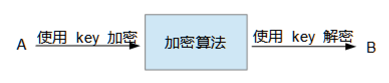

title: 了解签名和加密
date: 2019-12-05 15:15:27
tags: 加密,签名,哈希算法,信息安全
Category: 其他

## 总结

用一句话来解释签名和加密。

* 签名：确定发件人、避免信息在传输过程中内容被篡改。
* 加密：避免信息在传输过程中被第三方窃取到内容。

假设 A 给 B 发一条信息。B 可以根据签名，来判断这条信息是否来源于 A？是否是完整并且没有被被篡改？为了防止信息的内容被第三方窃取，A 和 B 可以约定一个只有他们自己可以看懂的加密方式，对信息进行加密，防止窃取。

## 签名

一个例子，A 要给 B 发一封电子邮件。

下面开始思考。

1. B 应该如何判断这封电子邮件是 A 发来的？
2. 如何保证 A 发送的信息没有被篡改过？

为了解决问题 1，A 在信息中签上自己的名字，B 熟知 A 的笔迹，可以判断是否是 A 发过来的信息。

但是上面的方案，没有办法保证信息的完整性，比如某个看到了信息的人，在信息中加了其他的信息（不破坏 A 的签名）。所以，为了解决问题 2，就需要把信息的全文提取，做个“签名”，并且这种签名要满足两点，第一，一个信息只能对应一个签名；第二，在只知道签名的情况下，不能计算出来对应的信息。

签名算法就应运而生了。

下面用最简单的 MD5 算法来作为例子，来解释**签名算法**在具体实例中的应用。

假设 A 要给 B 发送一条信息，内容是：

    明天十点老地方吃饭。

A 使用 MD5 算法，来签名这条信息，内容变成：

    明天十点老地方吃饭。
    MD5:0887F30C8A63DD13C6AF5EFBF003C80F

B 在接收到信息后，根据 MD5 算法，对照后，发现信息和签名完全对的上。

但是，这时候就出现问题了。如果 C 也熟悉 MD5 算法，就可以修改上面一条信息，变成：

    明天九点老地方吃饭。
    MD5:513059EEDED204527E4BA9E5DDED101A

B 也检验了签名，发现也没有问题。

所以，A 和 B 之间需要约定一个“暗号”，这个暗号只有 A 和 B 知道。A 在对信息进行签名的时候，要加上“暗号”。例如，A 和 B 约定的暗号是：love

A 发送给 B 的信息就变成（MD5("明天十点老地方吃饭。love")的值6F277AF59697AEBE0EBAB9421A6A8A9B）：

    明天十点老地方吃饭。
    MD5:6F277AF59697AEBE0EBAB9421A6A8A9B

B 接收到信息后，在内容加上“love”，计算签名，得出签名值一致，便可以确定信息来源是 A，也可以确定信息没有篡改过。因为 C 不知道这个暗号，并且根据签名是不能计算出来信息内容，这很重要！所以 C 没有办法更改信息并且计算新信息的签名值。

A 和 B 在约定“暗号”的签名后，就解决了刚刚提出的两个问题。

1. 防篡改。
2. 确定发件人。

即使 C 在当中看到了 A 和 B 的信息，也没有办法更改信息的内容。

> 常见的签名算法有 MD5 SHA256 等

## 加密

刚刚的例子中，假设 C 可以看到了 A 和 B 发送的信息。由于信息是铭文传送的，所以 C 是可以看懂内容的。

下面思考，如果 A 和 B 之间谈论的是秘密，不想被第三方看到怎么办？

于是，加密算法来了！

A 在发送信息的时候，使用密码 key 对信息加密，B 在接受信息时，先使用密码 key 解密，再读取信息。

这中加密方法加签名方法，可以保证信息即使在第三发 C 可以截取到的情况下，也不会被 C 窃取到内容和篡改。

### 对称加密

上面举的例子，A 和 B 都是用 key 对信息加密、解密。

这种，A B 双方使用同一个密码进行加密的加密方式就是“对称加密”。如图所示：

### 非对称加密 

如果 A 和 B 在加密和解密的时候，不使用同一个密码进行。这种加密就是“非对称加密”。如图所示：

其中 KEY_A 可以叫做“私钥”，KEY_B 可以叫做“公钥”。

