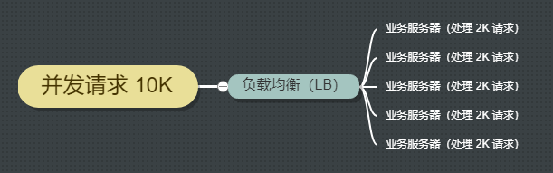

title: 高并发秒杀系统设计
date: 2020-01-09 23:10:01
tags: 高并发,c10k,秒杀系统
Category: 其他

## 从抢开始

我们假设，一个商品的秒杀活动会吸引一万人来参加，处理这个秒杀活动的难点在于：

1. 瞬发的高并发访问，10K 级别。
2. 用户秒杀成功（下订单），付款成功，秒杀商品的**库存在所有并发中同步**，如果不同步，会发生超卖或者少卖现象。

下面我们来讨论以上的问题。

## 负载均衡，分而治之

面对高并发的访问，一个业务服务器的处理能力可能不够，有时会造成没有相应等不好体验。

使用负载均衡技术，可以将请求分给多个业务服务器。

如上图，负载均衡服务器将发送过来的请求，分给多个业务服务器来处理。每个服务器处理自己力所能及的请求。解决单个业务服务器面对大并发请求的压力。

Nginx 提供了几种负载均衡的方法。具体内容请看文章[Nginx 提供的三种负载均衡方法]()。

## 库存数据的高并发读写

## 参考

1. [Golang concurrency](https://tour.golang.org/concurrency/1)
2. [Redis]()
3. [Using nginx as HTTP load balancer](https://nginx.org/en/docs/http/load_balancing.html)

